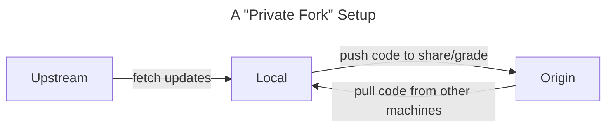

# SP23 Assignments

This repository contains template code for the assignments in the course. It will additionally serve as an _upstream repository_ to source potential updates and corrections for the assignments.

Assuming you've set up your repo according to the instructions below, you can run the following to pull the latest updates and corrections from the template repository and make sure your code is up-to-date:

```
git pull upstream <branch name>
```

Generally, each assignment will operate off of its own _branch_ while the _main_ branch will include the base template for an operational environment. Switch between branches by using the dropdown selector on the upper left.

## Choosing an environment

Before cloning this repo, decide what kind of development environment you'd like to work from using the guide at [Choosing an Environment](https://wustl-data.github.io/sp23/dev_env/choose_env)

## Setting up your private repo

Once you have chosen an environment method, carefully follow the instructions at [Setting up your Private Repo](https://wustl-data.github.io/sp23/dev_env/private_repo).

## Summary of git configuration

Here's how our git setup works in practice:



## Accessing assignment branches

First, make sure you have the latest copy of the repo, especially if updates have been pushed or you are beginning a new assignment.

```bash
git fetch upstream
```

The first time you need to switch to a new assignment branch, you will need to create a new local branch that tracks the version on the `upstream` repo.

```bash
git switch --track upstream/hw1
```

> Setting the tracking branch to the version on the `upstream` repo instead of the version on the `origin` repo (the default) makes it easier to notice your repo is outdated with `git status` as well as making it the default branch for fetching/pulling.

Any subsequent time you need to switch to the branch:

```bash
git switch hw1
```
