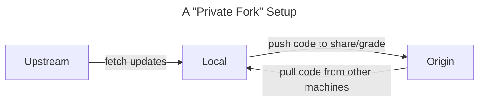

# SP23 Assignments

This repository contains template code for the assignments in the course. It will additionally serve as an _upstream repository_ to source potential updates and corrections for the assignments.

Assuming you've set up your repo according to one of our suggested [dev environment setups](https://wustl-data.github.io/sp23/Development%20Environment/choose_env), you can instantly pull the latest updates and corrections from the `upstream` remote to make sure your code is up-to-date:

```
git pull upstream hw1
```

## Choosing an environment

Before cloning this repo, decide what kind of development environment you'd like to work from using the guide at [Choosing an Environment](https://wustl-data.github.io/sp23/dev_env/choose_env)

## Setting up your private repo

Once you have chosen an environment method, carefully follow the instructions at [Setting up your Private Remote](https://wustl-data.github.io/sp23/dev_env/private_repo) to create your personal private remote in the `wustl-data` organization. This is where you will push code for grading or sharing.

## Our git configuration


