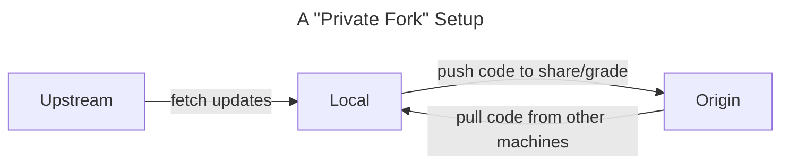

# SP23 Assignments

This repository contains template code for the assignments in the course. It will additionally serve as an _upstream repository_ to source potential updates and corrections for the assignments.

Assuming you've set up your repo according to the instructions below, run the following to fetch and merge the latest updates and corrections from the upstream repository to make sure your code is up-to-date:

```
git fetch upstream
```

> Note: `git fetch` only retrieves the latest changes from the upstream repo and saves them locally, it does not incorporate them into your active code -- `git merge` will do this in a later step.

If you want to review a log of the commits you'll be incorporating into your code, run:

```
git log upstream/hw1 ^hw1
```

> The caret `^` _excludes_ commits from the `hw1` branch, leaving only the commits that are unique to the `upstream/hw1` branch.

If you'd like to see the lines of code that where changed in a commit, run:

````
git show <first 6 digits of commit hash>
## Choosing an environment

Before cloning this repo, decide what kind of development environment you'd like to work from using the guide at [Choosing an Environment](https://wustl-data.github.io/sp23/dev_env/choose_env)

## Setting up your private repo

Once you have chosen an environment method, carefully follow the instructions at [Setting up your Private Repo](https://wustl-data.github.io/sp23/dev_env/private_repo).

## Summary of git configuration

Here's how our git setup works in practice:



If you're happy with the changes, merge them into your code:

```bash
git merge upstream/hw1
```
````
