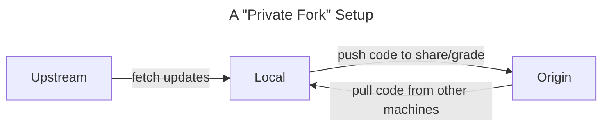

# SP23 Assignments

This repository contains template code for the assignments in the course. It will additionally serve as an _upstream repository_ to source potential updates and corrections for the assignments.

Assuming you've set up your repo according to the instructions below, you can run the following to pull the latest updates and corrections from the template repository and make sure your code is up-to-date:

```
git pull upstream <branch name>
```

Generally, each assignment will operate off of its own _branch_ while the _main_ branch will include the base template for an operational environment.

## Choosing an environment

Before cloning this repo, decide what kind of development environment you'd like to work from. Generally, you have three options:

### 1. A cloud-based "Dev Container" setup in GitHub Codespaces (Default IDE: VS Code, compatible with PyCharm)

_Choose this option if you have a fast and stable internet connection and like the idea of a 1-click setup (including Poetry installation!)_

#### Basic Steps

1. Set up your own private repo using the instructions in [Setting Up Your Private Repo](#setting-up-your-private-repo)
2. Click "Create a Codespace on \<branch\>" from the big green "Code" button at the top of the repo.

That's pretty much it. Wait for the environment to build and for your startup commands to execute until you are greeted with a terminal prompt.

### 2. A local Dev Container-based setup (Default IDE: VS Code, compatible with PyCharm)

_Choose this if you want much of the convenience of a 1-click setup while working from a local copy of your code. Working this way might requires installing a few basic dependencies and may at times require you to acquire some passing knowledge of how Docker containers work, but this method should still be pretty painless. Please create a discussion or issue if you are running into errors and stay tuned for more details on containers._

#### Basic Steps

1.  Install [Docker Desktop](https://www.docker.com/products/docker-desktop/)
2.  Install [VS Code](https://code.visualstudio.com/)
3.  Install the [Dev Container extension](https://marketplace.visualstudio.com/items?itemName=ms-vscode-remote.remote-containers) for VS Code
4.  Follow the instructions below to clone the repo if you have not already.
5.  Open the repo in VS Code either via the GUI or by using the `code` command in your terminal.
6.  Click the "Reopen in Container" button that pops up.
    - If you miss the window of opportunity for the button, find the "Dev Containers: Reopen in Container" option from the command palette.

### 3. A completely local setup with manually installed development dependencies.

_Choose this option if you want/require fine-grained control of your environment and are comfortable with installing and configuring development dependencies on your own or would like to challenge yourself to do so._

You will need, at minimum:

- A recent version of Python (I prefer to use [pyenv](https://github.com/pyenv/pyenv#installation) to manage my Python installations).
- If you want to use poetry: The [poetry](https://python-poetry.org/docs/) package manager.
- A _Unix_ shell is **highly recommended**.
  - On macs: Your default terminal is a Unix shell.
  - On Windows: You can use [WSL](https://learn.microsoft.com/en-us/windows/wsl/install) for a fully-featured Linux environment and terminal shell. If you insist on working fully on Windows, [Git Bash](https://gitforwindows.org/) _emulates_ a unix shell, although you still may run into trouble with some commands and packages.

More development dependencies may be required depending on the assignment.

Make a post in Discussions if you have any questions or run into any problems on your own!

## Setting up your private repo.

Once you have chosen an environment method, follow these instructions carefully at the appropriate step/when you are ready to clone the repo. These instructions are modified to fit our use case from [this Stack Overflow thread](https://stackoverflow.com/a/30352360/1526293).

1. Create a private repo named as your WUSTL username in the `wustl-data` GitHub Organization.
   - Don't add a README or .gitignore just yet.
2. _From a local terminal shell (i.e. not Codespaces)_, run:
   1. Clone the template repo
      ```bash
      git clone --bare https://github.com/wustl-data/sp23-assignments
      ```
      ```mermaid
      flowchart LR
         template([sp23-assignments]) -->|clone| local([Your Local Repo])
      ```
      >
   2. Move your _current directory_ to the cloned repo's folder
      ```bash
      cd sp23-assignments
      ```
   3. Push a version of the repo to your private repo
      ```bash
      git push --mirror https://github.com/wustl-data/<your wustl username>
      ```
      ```mermaid
      flowchart LR
         template([sp23-assignments])--> local([Your Local Repo])
         local-->|push| origin([Your Private Repo])
      ```
   4. Go back to your original working directory
      ```bash
      cd ..
      ```
   5. Delete your local version of the template repo
      ```bash
      rm -rf sp23-assignments
      ```
      ```mermaid
      flowchart LR
         origin([Your Private Repo])
      ```
3. _In your environment of choice_ (Codespace/Dev Container/Local Setup), do the following:

   1. Clone the repo using the URL from your private repo on GitHub:
      ```bash
      git clone https://github.com/wustl-data/<your wustl username>
      ```
      ```mermaid
      flowchart LR
         origin(["Your Private Repo #quot;origin#quot;"])-->|clone| local([Your Local Repo])
      ```
   2. Change your current directory to your local copy of the repo, now in a different folder

      ```bash
      cd <your wustl username>
      ```

   3. Add the `sp23-assignments` repo as an remote repo named 'upstream'.

      ```bash
      git remote add upstream https://github.com/wustl-data/sp23-assignments
      ```

      ```mermaid
      flowchart LR
         origin(["Your Private Repo #quot;origin#quot;"])<-.-> local([Your Local Repo])
         upstream(["sp23-assignments #quot;upstream#quot;"])-.->|remote add| local
      ```

Here's how our git setup will work in practice:



## Accessing assignment branches

First, make sure you have the latest copy of the repo, especially if updates have been pushed or you are beginning a new assignment.

```bash
git fetch upstream
```

The first time you need to switch to a new assignment branch, you will need to create a new local branch that tracks the version on the `upstream` repo.

```bash
git switch --track upstream/hw1
```

> Setting the tracking branch to the version on the `upstream` repo instead of the version on the `origin` repo (the default) makes it easier to notice your repo is outdated with `git status` as well as making it the default branch for fetching/pulling.

Any subsequent time you need to switch to the branch:

```bash
git switch hw1
```
